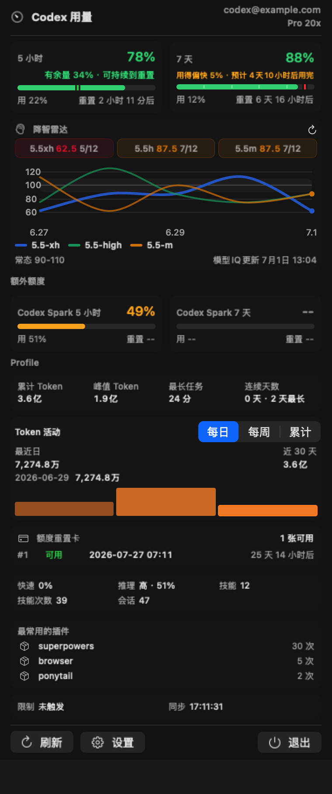
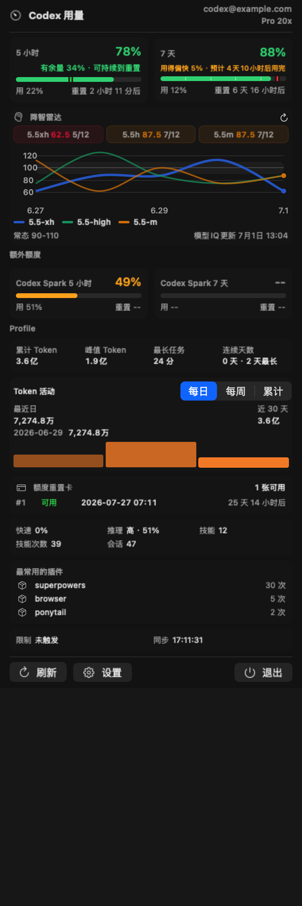
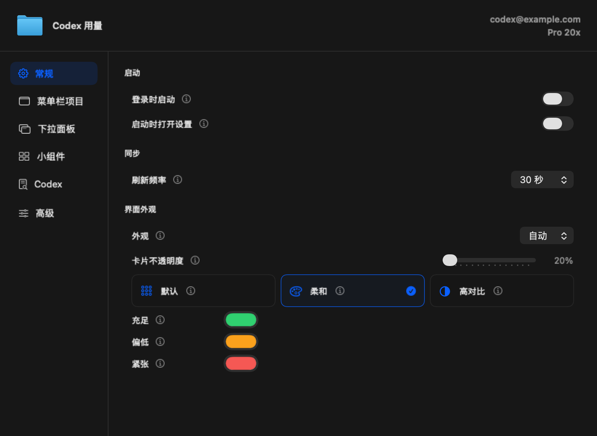
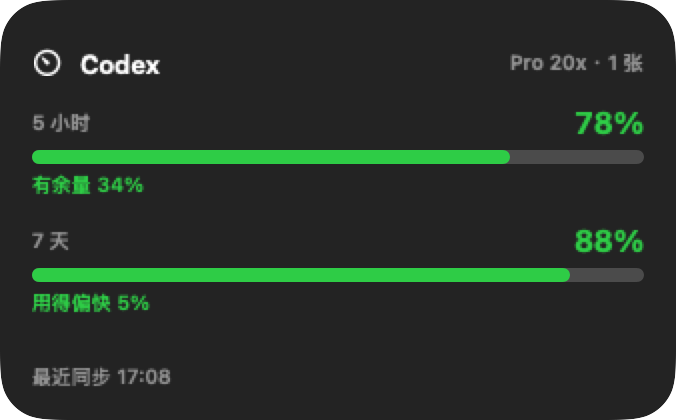

# CodexMeter

一款常驻 macOS 菜单栏的 Codex 用量仪表盘：把剩余额度、重置时间、使用节奏、重置卡、Token 活动和模型雷达集中到一个轻量面板中。



## 功能

- 菜单栏直接显示 5 小时与 7 天窗口的剩余额度，也支持接口返回的其他窗口组合。
- 下拉面板展示重置倒计时、用量速度、额外限制、重置卡、Token 活动、常用插件和同步状态。
- 模型雷达通过矩阵和折线展示不同模型、推理档位及近期 IQ 变化。
- WidgetKit 小组件展示最近缓存的额度快照，无需打开菜单栏面板。
- Codex hook 活动指示器可显示运行、思考、等待确认和完成状态。
- 支持登录时启动、刷新频率、菜单栏布局、组件显隐和明暗外观设置。
- 独立“关于”页面集中展示版本、自动检查开关、手动检查更新和项目链接。
- 内置 Sparkle 2，可后台检查、下载并安全安装新版本。

## 界面

### 用量、重置时间与模型雷达



### 设置



### 桌面小组件



截图使用脱敏数据，不包含真实账号信息。

## 安装

1. 从 [GitHub Releases](https://github.com/jinsihou19/CodexMeter/releases/latest) 下载最新 Universal DMG。
2. 打开 DMG，将 `CodexMeter` 拖入“应用程序”。
3. 首次启动若被 Gatekeeper 拦截，请在 Finder 中右键应用并选择“打开”。

系统要求：macOS 14.0 或更新版本。

### 从 CodexUsage 桥接升级

首个 CodexMeter 版本需要手动覆盖一次旧应用。安装包仍使用兼容路径 `/Applications/CodexUsage.app`，但 Finder 和界面显示为 `CodexMeter`；原有设置、额度缓存、Widget 和登录启动状态会继续保留。

旧版本本身没有更新器，因此无法自动完成这一次桥接。桥接完成后，后续版本均可通过 Sparkle 自动更新。

## 自动更新

Sparkle 默认每天检查一次更新，也可以在“设置 → 常规 → 更新”中手动检查。

- 更新源：<https://jinsihou19.github.io/CodexMeter/appcast.xml>
- 安装包：GitHub Releases
- 校验：Sparkle EdDSA 签名

当前 Release 使用 ad-hoc 签名，适合本机和小范围分发；面向公众长期分发时建议增加 Developer ID 签名与 Apple 公证。

## 数据与隐私

CodexMeter 从 `CODEX_HOME/auth.json` 或 `~/.codex/auth.json` 读取本机 Codex token，并请求：

1. `GET https://chatgpt.com/backend-api/wham/usage`
2. `GET https://chatgpt.com/backend-api/wham/profiles/me`
3. `GET https://chatgpt.com/backend-api/wham/rate-limit-reset-credits`

token 只在内存中用于请求，不会由应用另行落盘。项目 hook 只写入轻量活动状态，不包含 prompt、transcript 或工具输出。

为保留旧版数据，Bundle ID、App Group、Widget kind 和缓存目录继续使用旧兼容标识；请勿在普通改名中修改它们。

## 开发

项目使用 Xcode、Swift 6、AppKit、SwiftUI 与 WidgetKit。

```bash
rtk xcodebuild -project CodexMeter.xcodeproj -scheme CodexMeter -destination 'platform=macOS' test CODE_SIGNING_ALLOWED=NO
rtk xcodebuild -project CodexMeter.xcodeproj -scheme CodexMeter -destination 'platform=macOS' build CODE_SIGNING_ALLOWED=NO
```

运行真实用量接口集成测试：

```bash
rtk xcodebuild -project CodexMeter.xcodeproj -scheme CodexMeter -destination 'platform=macOS' test CODE_SIGNING_ALLOWED=NO CODEX_USAGE_RUN_INTEGRATION=1
```

## 打包与发布

确认工作区已经提交并推送后，一条命令完成 Universal DMG 打包、本机安装、GitHub Release 上传和 Pages 启用：

```bash
rtk bash script/package_release.sh
```

指定新语义版本：

```bash
CODEX_RELEASE_VERSION=1.1.0 rtk bash script/package_release.sh
```

需要仅做本地打包和安装、不创建远程 Release 时：

```bash
CODEX_PUBLISH_RELEASE=0 rtk bash script/package_release.sh
```

默认发布模式要求工作区干净，并且本机已安装、登录 [GitHub CLI](https://cli.github.com/)。Release 发布后，[Pages 工作流](.github/workflows/publish-appcast.yml)会自动把已签名的 `appcast.xml` 部署到更新源。

发布产物命名为 `CodexMeter-<version>-<build>-universal.dmg`。语义版本使用 `MAJOR.MINOR.PATCH`，构建号单调递增；只有构建、安装和远程发布全部成功后才推进下一构建号，本地模式则在本地步骤全部成功后推进。

## Codex Hook

仓库包含项目级 hook 桥接：

- `.codex/hooks.json`
- `.codex/hooks/codex_activity.py`

通过 `/hooks` 信任项目 hook 后，活动状态会写入旧版兼容 App Group 容器，CodexMeter 会聚合并显示当前 Codex 会话状态。
