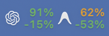
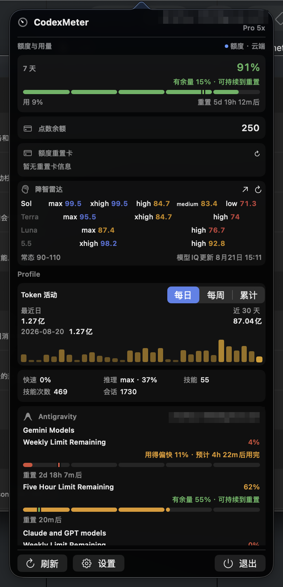
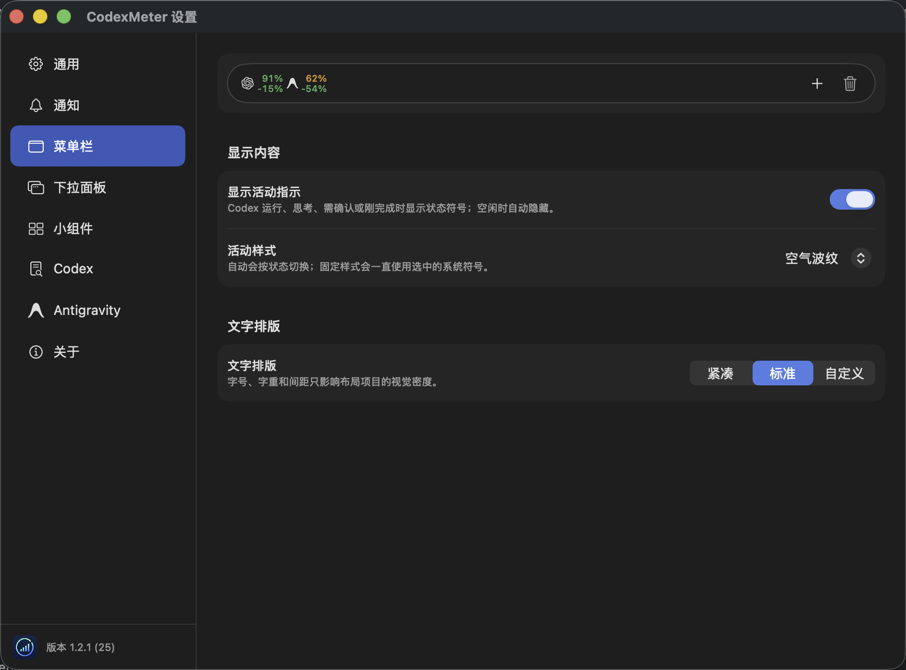
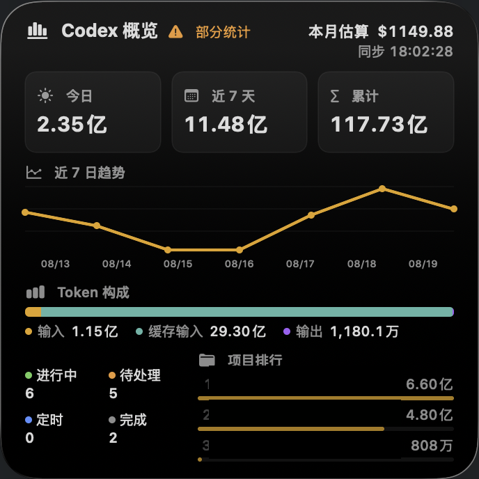
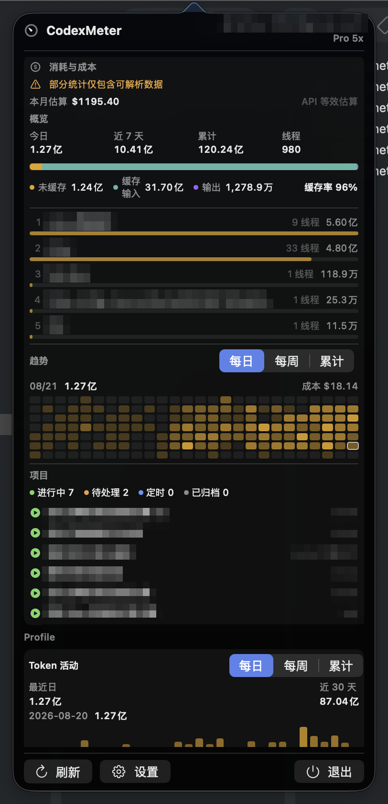

# CodexMeter

常驻 macOS 菜单栏的 Codex 用量仪表盘：把云端额度、本机 Token 活动、重置时间、使用节奏、成本估算和模型雷达集中到一个轻量面板中。

当前 README 按最新代码和 UI 更新维护。截图来自实际运行中的 CodexMeter，已去除账户标识、项目名、Token 和成本等本机操作信息；额度数字仅用于说明布局。





## 当前功能

### 菜单栏布局

- 拖动菜单栏项目调整顺序；项目可以独立显示，也可以在一个容器内上下堆叠，最多两行。

- Codex 和 Antigravity 图标保持独立，不会被错误合并到额度堆叠中。

- 可添加 5 小时、7 天、余额、重置时间、预期偏差、本机成本等项目；没有可信数据的项目会自动隐藏。

- 支持紧凑、标准、自定义三种文字排版，并可调整字号、字重、项目间距和行距。

- 支持活动指示器和“空气波纹”等指示样式，便于观察当前 Codex 会话状态。



### Codex 云端额度

- 展示 5 小时、7 天及接口返回的其他额度窗口。
- 支持额度重置卡、实时重置倒计时和按工作日刻度计算的预期消耗速度。
- 使用胶囊分段进度条区分实际剩余、理论节奏和预期偏差；工作日刻度可配置为 5 天或 7 天。
- 网络请求失败时继续展示最近一次成功同步的快照。

### 下拉面板

- 可独立开关额度、额外额度、重置卡、Profile 概览、Token 活动、活动洞察和常用插件模块。
- 本机消耗与成本支持概览、趋势、项目和任务模块；趋势可以切换每日、每周和累计口径。
- 支持 26 周 Token 热力图、项目消耗排行和今日任务分类。
- Codex Radar 支持模型矩阵、模型 IQ 卡片和历史折线图，并可独立启停。

### 本机统计与成本

CodexMeter 以只读方式读取当前 `CODEX_HOME` 下的 Codex 状态库、会话索引和 rollout，聚合展示：

- 今日、近 7 天和累计 Token；缓存输入、非缓存输入和输出构成。
- 会话/线程数量、项目排行、任务状态和 Token 活动趋势。
- 按已知模型 API 价格计算的等效成本；未知模型或不完整会话会标记为部分统计，不会强行猜价。
- fork 会话去重和 Token 精度修正，避免父子会话继承用量重复计入。

更多字段、读取边界和本地文件说明见[本机统计说明](docs/1.md)。

### Antigravity

- 可选启用 Antigravity，选择全部模型或指定模型配额组。
- 支持在下拉面板和菜单栏分别显示 Antigravity 配额。
- 5 小时窗口优先用于菜单栏摘要和紧张窗口判断。
- 配额优先读取正在运行的本地 Antigravity 服务；本地服务不可用时才尝试已保存的 Google OAuth 配置。

### 小组件、通知与更新

- WidgetKit 提供额度小组件和本机统计小组件，共享主应用最近一次成功同步的安全快照。
- 小组件可配置显示窗口、重置时间、预期消耗速度、最近同步和账户摘要。
- 额度窗口归零时可发送系统通知，并支持 5 小时/7 天重置彩带庆祝效果。
- 支持登录时启动、刷新频率、明暗外观、中英文界面和诊断入口。
- 内置 Sparkle 2，默认每天检查更新，也可在“设置 → 关于 → 更新”手动检查。



## 重点界面

### 菜单栏

菜单栏只保留最重要的实时读数；Codex 与 Antigravity 可以分别配置图标、额度窗口和上下堆叠项目。


### 下拉面板

下拉面板集中展示额度、重置卡和 Codex Radar；本机 Token、项目和成本模块可按需开启。



## 安装与替换

1. 从 [GitHub Releases](https://github.com/jinsihou19/CodexMeter/releases/latest) 下载最新 Universal DMG。
2. 打开 DMG，将 `CodexMeter.app` 拖入“应用程序”，确认替换旧版本。
3. 首次启动若被 Gatekeeper 拦截，在 Finder 中右键应用并选择“打开”。

手动拖拽 DMG 时，Finder 只负责复制 App，不会执行仓库里的安装脚本。更新前请先从菜单栏退出旧版，再拖拽并确认替换；否则旧实例仍可能占用菜单栏，产生多个图标。

本机发布脚本会自动结束正在运行的 `CodexMeter`、旧版 `CodexUsage` 和 Widget 进程，等待退出后删除旧包，再安装并启动唯一的 `/Applications/CodexMeter.app`：

```bash
CODEX_PUBLISH_RELEASE=0 CODEX_INSTALL_LOCAL=1 bash script/package_release.sh
```

系统要求：macOS 14.0 或更新版本。

### 首次使用

- Codex 额度从 `CODEX_HOME/auth.json` 或 `~/.codex/auth.json` 读取现有登录状态；应用不会替你登录，也不会保存认证 token 副本。
- 本机统计需要当前用户可以读取 Codex 状态库；数据库不存在或 schema 不兼容时，网络额度仍可正常使用。
- Antigravity 为可选功能；开启后会优先探测本地服务，必要时再使用已有 Google OAuth 配置。
- 使用 Codex hook 活动指示器前，先通过 `/hooks` 信任项目 hook。

### 标识迁移

应用、Bundle ID、App Group、Widget kind 和缓存目录统一使用 CodexMeter 标识。首次启动新版时，如果检测到旧版 CodexUsage 的配置，应用会询问是否迁移显示和偏好设置；缓存、授权和每日请求状态不会迁移。

## 数据来源与隐私

### Codex 云端额度

CodexMeter 使用本机已有 token 请求以下接口：

1. `GET https://chatgpt.com/backend-api/wham/usage`
2. `GET https://chatgpt.com/backend-api/wham/profiles/me`
3. `GET https://chatgpt.com/backend-api/wham/rate-limit-reset-credits`

token 只在内存中用于请求，不会写入 CodexMeter 的缓存、日志或 Widget 快照。网络请求失败时，应用会继续展示最近一次成功保存的快照。

### 本机统计

本机统计只读访问当前 `CODEX_HOME` 下的 `state_5.sqlite`、`session_index.jsonl`、automation 配置和数据库引用的 rollout 文件。共享快照不包含 prompt、transcript、工具输出、完整工作目录或任务标题。

菜单里的“估算成本”按已知模型的公开 API 价格计算：

```text
非缓存输入 × 输入单价 + 缓存输入 × 缓存单价 + 输出 × 输出单价
```

这是 API 等效成本估算，不是订阅账户账单；未知模型或不完整会话不会被强行猜价，界面会标记为部分统计。

### 其他网络数据

- Codex Radar 读取 <https://codexradar.com/current.json>，只用于模型雷达展示。
- Antigravity 额度优先读取本地服务；本地服务不可用时才尝试已有 Google OAuth 配置。
- 项目 hook 只写入轻量活动状态，不包含 prompt、transcript 或工具输出。

## 自动更新

Sparkle 默认每天检查一次更新，也可以在“设置 → 关于 → 更新”中手动检查。

- 更新源：<https://jinsihou19.github.io/CodexMeter/appcast.xml>
- 安装包：GitHub Releases
- 校验：Sparkle EdDSA 签名

当前 Release 使用 ad-hoc 签名，适合本机和小范围分发；面向公众长期分发时建议增加 Developer ID 签名与 Apple 公证。

## 开发

项目使用 Xcode、Swift 6、AppKit、SwiftUI 与 WidgetKit。

```bash
xcodebuild -project CodexMeter.xcodeproj -scheme CodexMeter -destination 'platform=macOS' test CODE_SIGNING_ALLOWED=NO
xcodebuild -project CodexMeter.xcodeproj -scheme CodexMeter -destination 'platform=macOS' build CODE_SIGNING_ALLOWED=NO
```

运行真实用量接口集成测试：

```bash
xcodebuild -project CodexMeter.xcodeproj -scheme CodexMeter -destination 'platform=macOS' test CODE_SIGNING_ALLOWED=NO CODEX_USAGE_RUN_INTEGRATION=1
```

## 打包与发布

推荐在 GitHub 仓库的 Actions 页面手动运行“打包并发布 CodexMeter”。工作流会自动选择递增构建号、构建 Universal DMG、创建 Release，并把已签名的 `appcast.xml` 部署到 Pages。首次使用前，需要在仓库 Actions Secret 中配置 `SPARKLE_PRIVATE_KEY`。

本机发布需要工作区已经提交并推送，且本机已安装、登录 [GitHub CLI](https://cli.github.com/)：

```bash
bash script/package_release.sh
```

需要指定新语义版本时，设置 `CODEX_RELEASE_VERSION` 环境变量，格式为 `MAJOR.MINOR.PATCH`。

发布产物命名为 `CodexMeter-<version>-<build>-universal.dmg`。语义版本使用 `MAJOR.MINOR.PATCH`，构建号单调递增；只有构建、安装和远程发布全部成功后才推进下一构建号。

## Codex Hook

仓库包含项目级 hook 桥接：

- `.codex/hooks.json`
- `.codex/hooks/codex_activity.py`

通过 `/hooks` 信任项目 hook 后，活动状态会写入 CodexMeter App Group 容器，CodexMeter 会聚合并显示当前 Codex 会话状态。它是本地会话活动指示，不是 OpenAI 账单或计费接口。
